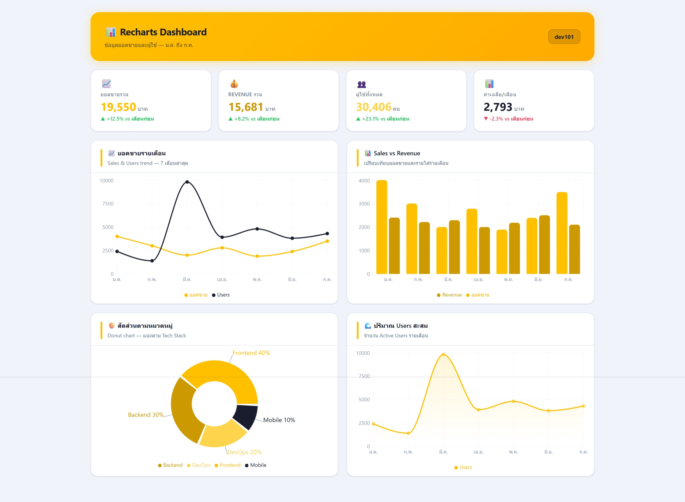

# Recharts Demo 📊

โปรเจกต์ตัวอย่างสำหรับแสดงกราฟประเภทต่าง ๆ ด้วย **Recharts** บน **React + Vite**



---

## กราฟที่มีในโปรเจกต์นี้

| กราฟ | ไฟล์ | ข้อมูลที่ใช้ |
|------|------|-------------|
| Line Chart | `LineChartDemo.jsx` | ยอดขายและรายได้รายเดือน |
| Bar Chart | `BarChartDemo.jsx` | ผลงานแต่ละแผนกแบ่งตามไตรมาส |
| Pie Chart | `PieChartDemo.jsx` | ส่วนแบ่งตลาดของสินค้า |
| Area Chart | `AreaChartDemo.jsx` | ยอดขายและรายได้รายเดือน (แบบพื้นที่) |

---

## โครงสร้างโปรเจกต์

```
recharts-demo/
├── src/
│   ├── data/
│   │   └── sampleData.js       ← ข้อมูล Mock สำหรับกราฟทั้งหมด
│   ├── components/
│   │   ├── LineChartDemo.jsx
│   │   ├── BarChartDemo.jsx
│   │   ├── PieChartDemo.jsx
│   │   └── AreaChartDemo.jsx
│   └── App.jsx                 ← หน้าหลักที่รวมกราฟทั้งหมด
```

---

## วิธีติดตั้งและรัน

### 1. ติดตั้ง dependencies

```bash
npm install
```

### 2. รันในโหมด Development

```bash
npm run dev
```

จากนั้นเปิดเบราว์เซอร์ที่ `http://localhost:5173`

### 3. Build สำหรับ Production

```bash
npm run build
```

---

## เทคโนโลยีที่ใช้

- [React](https://react.dev/) — UI Library
- [Vite](https://vite.dev/) — Build Tool
- [Recharts](https://recharts.org/) — ไลบรารีสำหรับวาดกราฟ
